# Deployment Guide 
Please follow the steps below to set up the Azure environment

## Step 1: Download Files
Clone or download this repository and navigate to the project's root directory.

## Step 2: Setting up Azure Data Lake Storage
The Azure Data Lake Storage (ADLS) is used to receive and store the invoice files. The Logic Apps will send the invoice files stored in ADLS to the Form Recognizer model to extract fields. In addition, if you upload invoice files to the same location, and the Logic Apps will pick up the new files or updated files and process them. 

1. Go to the [Azure Portal](portal.azure.com) and select the Storage Account that was created as part of the Azure Resources Creation process. 
2. In the menu pane on the left, under `Data storage`, select `Containers`.
3. Select the `invoiceadlsfs` container and add two new directories - `samples` and `uploaded`
4. In the `samples` folder created in the previous step, upload all the files from  [Data/FormsRecognizerLabelData/Invoices](./Data/FormsRecognizerLabelData/Invoices) folder

## Step 3: Train Form Recognizer Models for Invoices
### Step 3.1: Train Invoice Model 
In this step you will train a custom Form Recognizer models for invoices

1. Go to [Form Recognizer Studio](https://formrecognizer.appliedai.azure.com/studio), scroll down and select  "Custom Model", click "Create new"

2. Select "+Create a project" to create a project for labeling. 
3. Enter Project name: `InvoicesProject` or any other project name of your choice.
4. Enter Description: `Custom form recognizer model with sample invoices` and click "Continue".
5. This step connects the form recognizer studio to form recognizer resource in your subscription. Select your Subscription, Resource Group, and Form Recognizer resource, which was created during the deployment and select the latest API Version. Click "Continue"

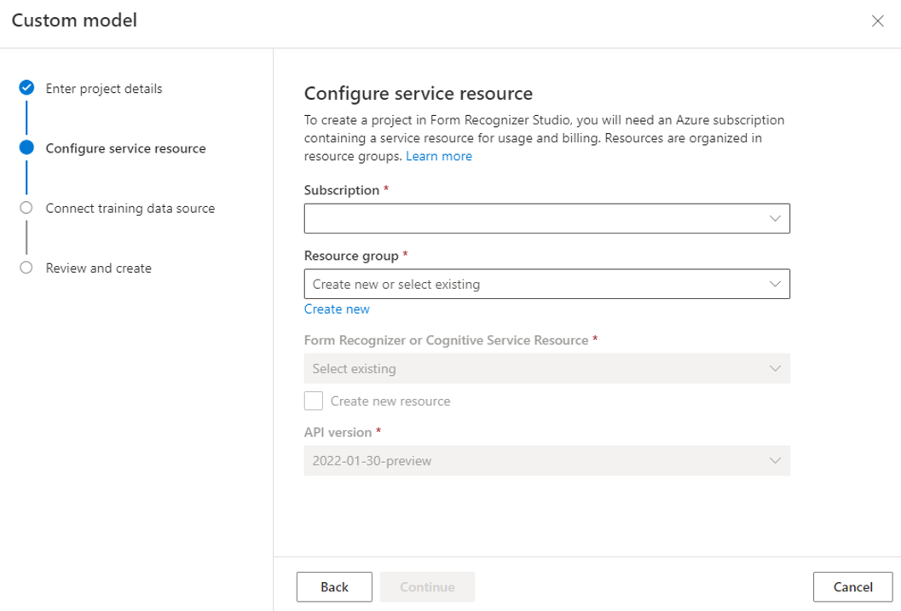

6. This step connects the form recognizer studio to ADLS storage/container resource in your subscription to access the training data. Select subscription, Resource Group, storage account, container: `invoiceadlsfs` and folder `samples`, which was created during the deployment. Click "Continue". Review Information and click "Create Project"

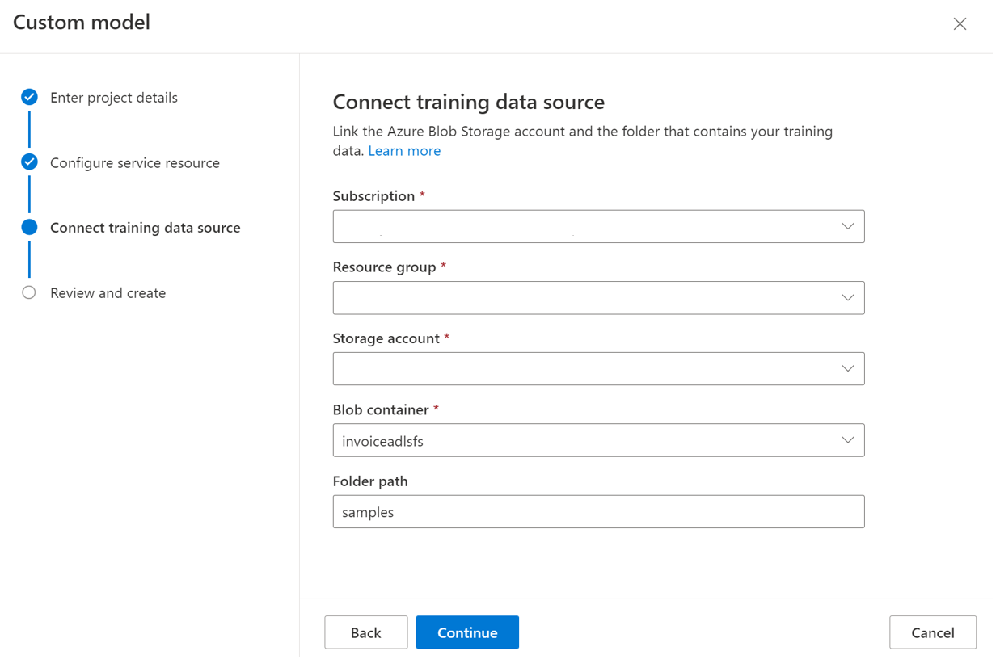

7. After the project is created, forms with OCR, Key-Value pair labels will appear like below

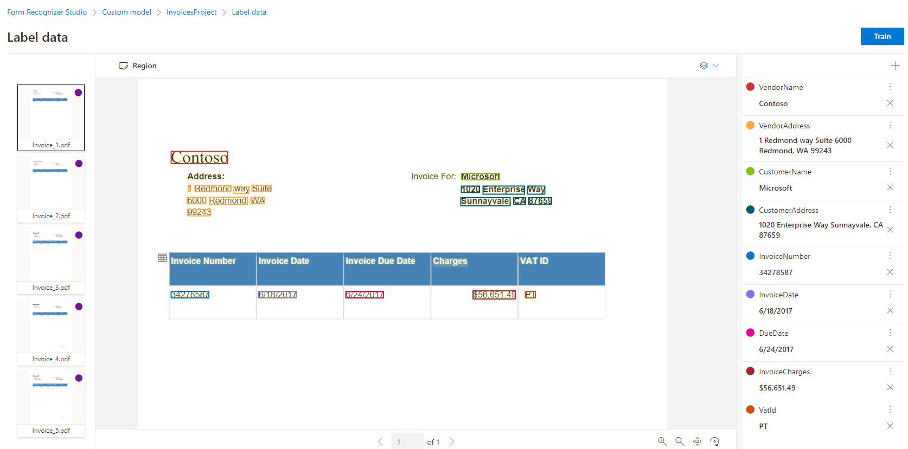

8. Click `Train`, fill in information as below, and select the dropdown "Build Mode" to `Template`, and then click `Train`
> Be sure to set the model Id to `Invoicesmodel`, as this is used in later steps

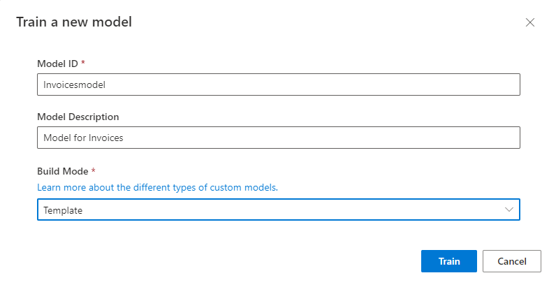

9. Once the training is done, the model will be located in Models tab with confidence score of each field.

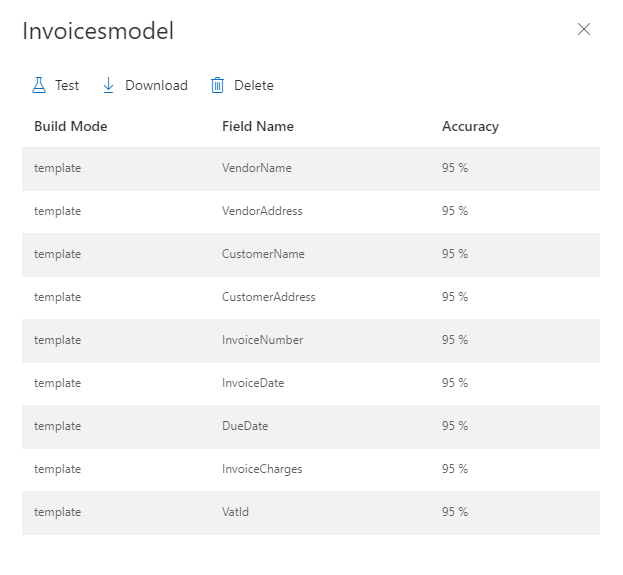

10. This is the modelID which will be used in calling the form recognizer model from Logic App 

    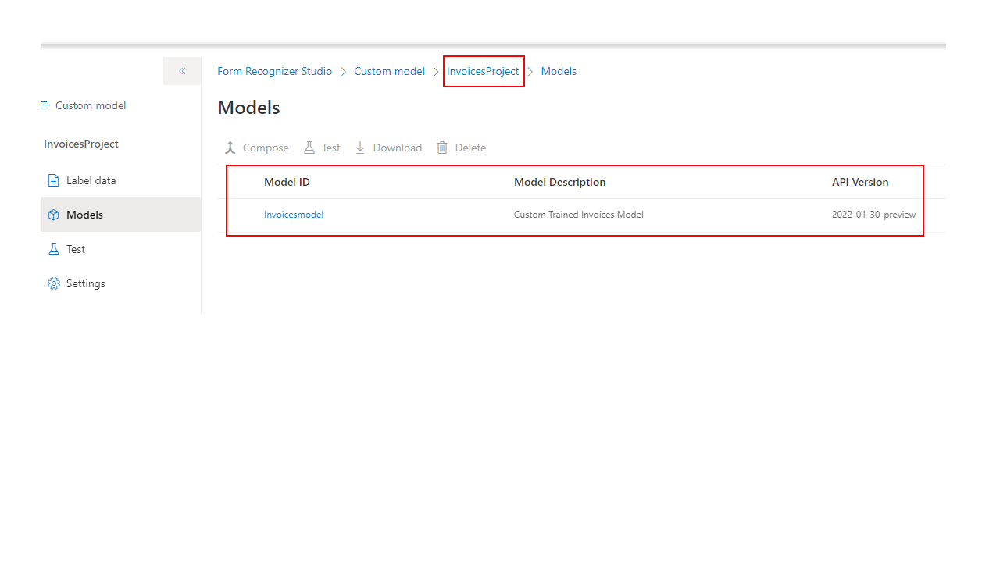

### Step 3.2: Set up System Assigned Identity 
1. Go to the [Azure Portal](portal.azure.com) and select the Form Recognizer service that was deployed in previous steps
2. Select `Identity` under "Resource Management" on the left switch the "status" to `On` under "System assigned" and click "Save" at the top

### Step 3.3: Update Storage Account Permissions 
In order to perform the necessary actions in Logic Apps, you will need to grant more access.
1. Go to the Azure Data Lake Storage Account that was deployed in the previous step
2. Go to the `Access Control (IAM) > + Add > Add role assignment`
3. Now search and select the `Storage Blob Data Contributor` role and click "Next"
4. Select `Managed identity` for "Assigned access to" 
5. Click "+ Select members", search and select your Form Recognizer that was deployed in the previous steps and click "Select"
6. Click Review and assign at the bottom

## Step 4: Deploy Logic Apps

In this step you will deploy the required resources to process invoices sent via email. 
The logic apps we are going to build will help us ingest the invoices and process them.

### Deploy the Logic Apps
The button below will deploy Azure Logic Apps into the resource group you are using for this solution:

### **Configuring the ARM template**
In order for the logic apps to work, we need to configure the following variables. 

Populate the variables accordingly:

1. **Resource group**: Use the `same resource group` where the previous ARM template was deployed.

2. **Region**: This field will be auto-filled

3. **Suffix Name**: Insert a `suffix name` (e.g. Your initials)

4. **ADLS Name**: Provide the `same Storage Account` name that was created in previous steps

5. **Ocp-Apim-Subscription-Key**: The `forms recognizer access key`.
    * Navigagte to the Form Recognizer resource in your resource group
    * Select `Keys and Endpoint` on the left and copy `Key 1`

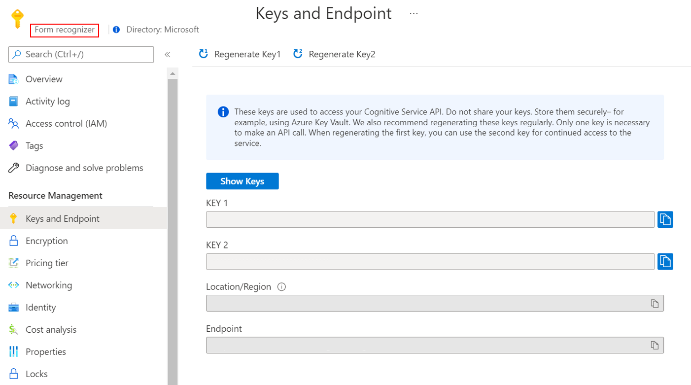

## Step 5: Setting up Connectivity from Key Logic App Components

There are two Logic Apps in this solution. One is referred as "**Email Processing Logic App**", the other "**Invoice Processing Logic App**" in the  [**Solution Architecture Diagram**](./img/InvoiceSAArchitecture.png). 

In this step you will set up the connectivity to Office 365 Outlook, Azure Blob Storage, and Azure Form Recognizer. 

### Step 5.1: Enable Managed Identity in the Email Processing Logic Apps 
1. Go to the [Azure Portal](portal.azure.com) and select the logic app for email processing. You should see one that looks like `xxxxemail`
2. Select `Identity` on the left side and select `User assigned` at the top 
3. Select "+ Add", search and select the user assigned managed identity that you are using for this soltution
4. Click "Add"

### Step 5.2: Set up connection for the "Email Processing Logic App"
> `Note: This step assumes that you've already created an outlook account that can receive invoices as attachments.` 

1.  Go to the [Azure Portal](portal.azure.com) and select the logic app for email processing. You should see one that looks like `xxxxemail`
2. Select the Logic app designer on the left and click on the `Outlook` connection, and sign in to your Outlook account

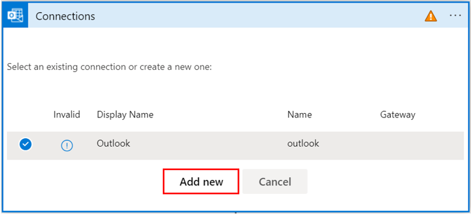

3. Select the `For each` step, select the `Condition` step and select the blob `Connection` under `False`, click "Add new", 

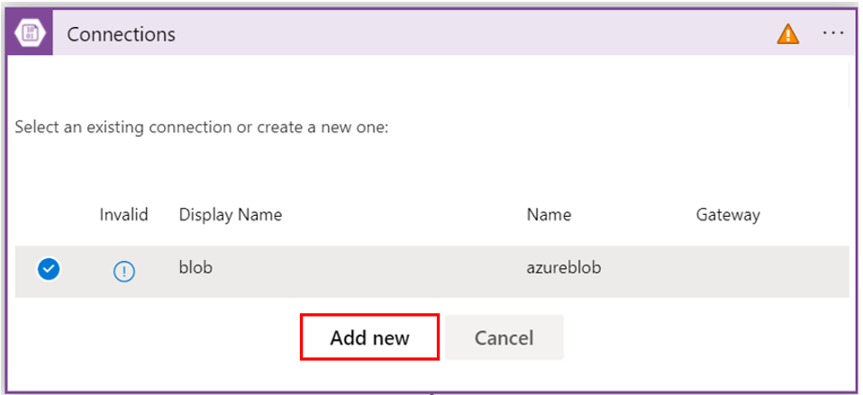

4. Provide `azureblob` for the name of the connection, under authentication type select `Logic Apps Managed Identity (preview)` and select "Create"

5. Click "Save at the top

   * We use "Office 365 Outlook" connection to extract invoices as email attachment, leveraging the "When a new email arrives" trigger.  This trigger will prompt you to sign into Outlook with your credentials. Detailed instructions are provided here: [Connect to Office 365 Outlook - Azure Logic Apps | Microsoft Docs](https://docs.microsoft.com/en-us/azure/connectors/connectors-create-api-office365-outlook)

   * For detailed instruction on how to create and manage user defined identities, please refer to [Manage user-assigned managed identities - Azure AD | Microsoft Docs](https://docs.microsoft.com/en-us/azure/active-directory/managed-identities-azure-resources/how-manage-user-assigned-managed-identities?pivots=identity-mi-methods-azp). 

   * For detailed instructions on how to set up authentication using managed identities, please refer to this document, and pay attention to the section for user defined managed identity: [Authenticate connections with managed identities - Azure Logic Apps | Microsoft Docs](https://docs.microsoft.com/en-us/azure/logic-apps/create-managed-service-identity?tabs=consumption).

### Step 5.3: Enable Managed Identity in the Invoice Processing Logic Apps 
1. Go to the [Azure Portal](portal.azure.com) and select the logic app for email processing. You should see one that looks like `xxxxinvoice`
2. Select `Identity` on the left side and select `User assigned` at the top 
3. Select "+ Add" search and select the user assigned managed identity that you are using for this soltution
4. Click "Add"

### Step 5.4: Set up connection for "Invoice Processing Logic App"

Connectivity and invocations to Azure Form Recognizer are established by three actions: 

1.  Go to the [Azure Portal](portal.azure.com) and select the logic app for Invoice processing. You should see one that looks like `xxxxinvoice`
2. Select the Logic app designer on the left and click on the blob `Connection` connection, click "+Add new" 

3. Provide `azureblob` for the name of the connection, under authentication type select `Logic Apps Managed Identity (preview)` and select "Create"

4. Select the container path `/invoiceadlsfs/uploaded/`

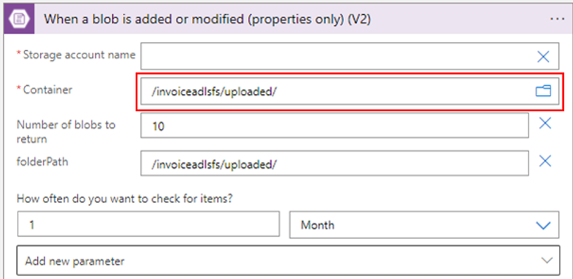

5. Select the `Azure Cosmos DB` connection, click "+Add new"

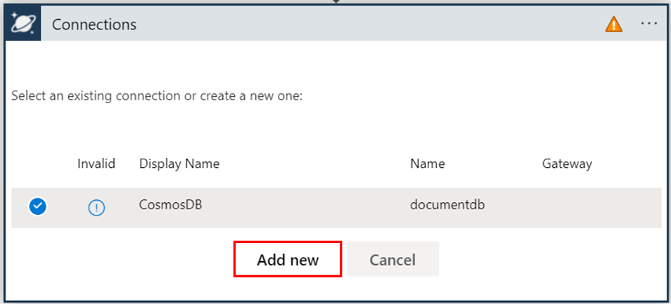

6. Provide `documentdb` for the name of the connection, provide the Access Key for your Cosmos DB account, the Account ID and click "Create"
   * To get the Access Key, go to the [Azure Portal](portal.azure.com) and select the Cosmos DB resource you are using for this solution, click `Keys` under "Settings" and copy the "Primary Key"
   * The Account ID is the name of the Cosmos DB account you are using for this solution 

7. Click "Save at the top

## Step 6: Testing Logic Apps
1. To test the "Email Processing Logic App," you can send an email with sample invoice [Sample Test Invoice](./Data/invoices/invoice_7.pdf) as attachment to the the mailbox you set up in the "Email Processing Logic App". 

> `Note: The attachment should be less than 3MB in order for the Logic App to work.`

2. Before sending the email, open the Logic App interface and click 'Run Trigger'. The Logic App should start working. 

3. To test the "Invoice Processing Logic App", click 'Run Trigger', and upload invoices files to specific Azure Data Lake Store container and folder that was set up in the Logic App. 

## Step 7: Power BI Set Up 

1. Open the [Power BI report](PowerBI/Invoice-PBI-Report.pbix) in this repository. 

2. Click the Transform data dropdown and click `Edit Parameters`, as illustrated below: 

   

3. Fill in the URI of your Cosmos DB account, as illustrated below, and click Ok. Please note: You need to replace '`cosmosdbaccountname`' below with your own Azure Cosmos DB account name. 

   

4. Click the Transform data dropdown and click `Data source settings`, as illustrated below: 

   

   

5. Select  `Change Source ...`, Select Azure Cosmos DB symbol, Select `Edit Permissions...`,  click `Edit...` , and fill in your Cosmos DB Account Key, as illustrated below

   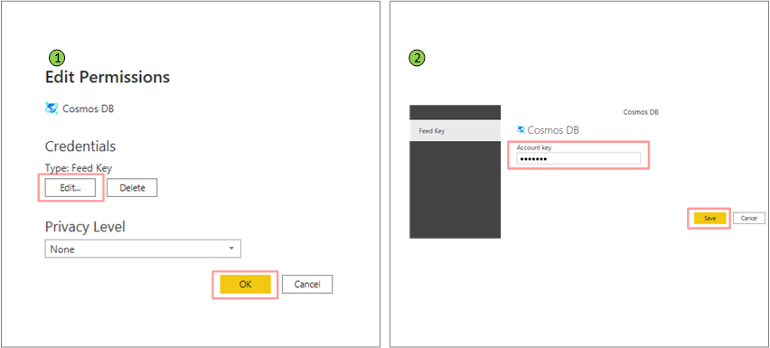

   

## Step 8 (Optional): Develop Your own Power BI Report 

Optionally, if you would like to develop Power BI Models afresh, you can open your PowerBI desktop, Select  `Get Data Source ...`, choose Azure Cosmos DB, and click 'Connect', as illustrated in below steps. 

1. Connect to Azure Cosmos DB 

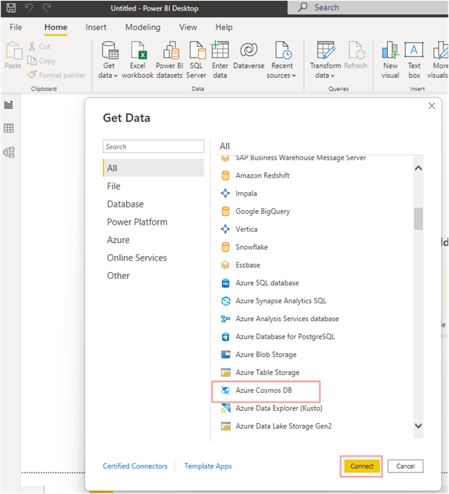

2. Fill in the information as illustrated below: 

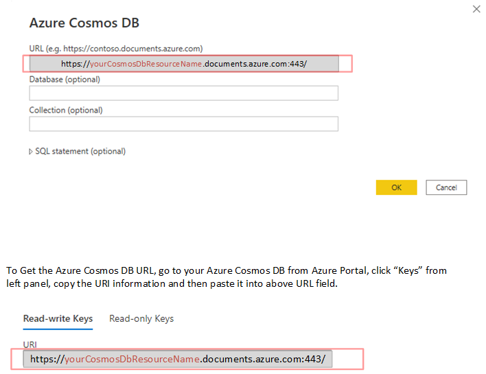

3. Load and transform data as desired, and develop visualized reports as desired. 

4. Add Text Filter Extension to Visualization, as illustrated in below picture.

   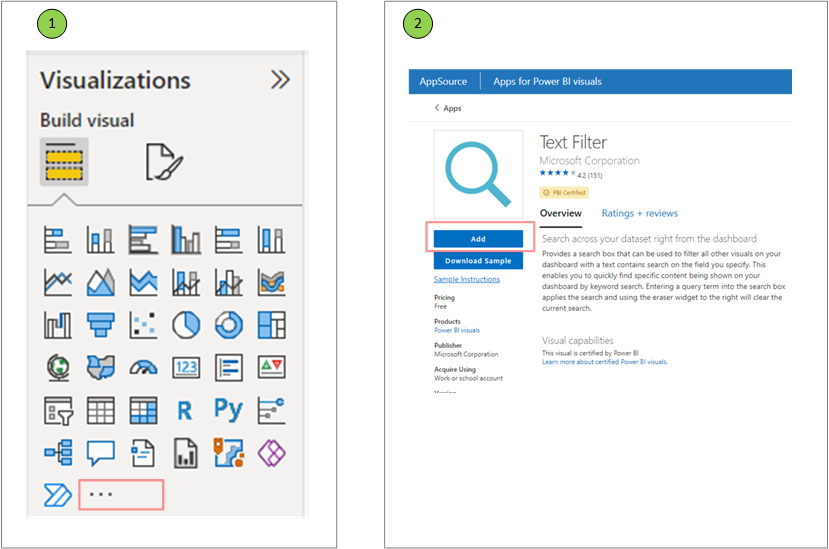

5. You can parameterize the Azure Cosmos DB account URI, by selecting your Power BI table where you pull Azure Cosmos DB data into, for example, `fieldlistcustom_source`, click `advanced editor` in the query pane, review the code, and replace the original Azure Cosmos DB URI with the parameter you defined, for example, `CosmosDbURI`. You need to create a parameter named `CosmosDbURI`, and the refer to Step 7 on how to set the value of the parameter.

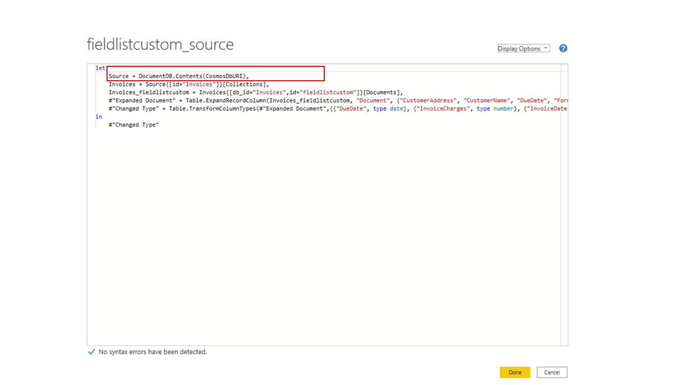
