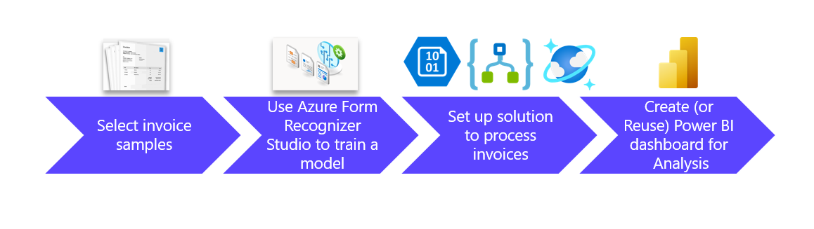
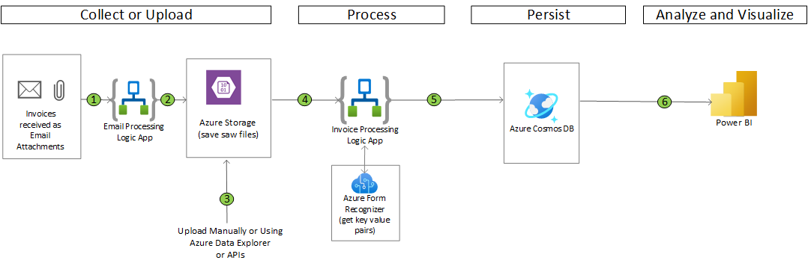
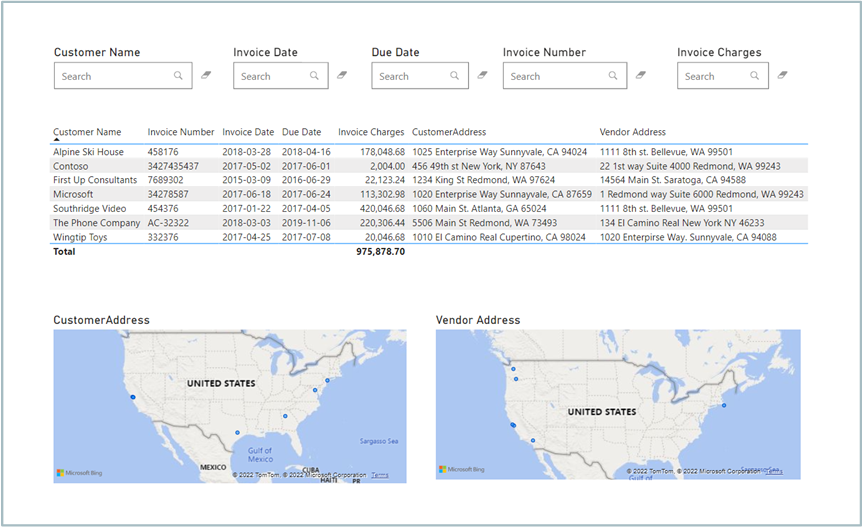
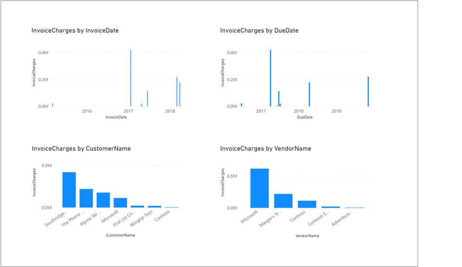

# Azure Invoice Process Automation Solution Accelerator

Invoice generation and processing are vital for businesses. Manually processing invoices are costly and error prone. Conventionally programmed or automated processes can be rigid, costly to maintain, and difficult to enhance. 

We'd like to introduce a low cost and low code solution that utilizes **Azure Forms Recognizer** and **Azure Logic App**. The Azure Forms Recognizer is a cloud-based Azure Applied AI service that uses machine learning models to extract and analyze fields, text, and tables from documents or images. The Azure Forms Recognizer enables businesses to process a variety of documents, including invoices, receipts, driver licenses, passports, and business cards. Azure Logic App enables solution developers to quickly design and deploy an end to end invoice processing solution. The Custom Form Recognizer Model can be easily created using Azure Forms Recognizer Studio.

**Who can leverage this solution?** Businesses that receive large number of invoices with a variety of  predicable formats. 

**Outcome of the solution**: Key inventory fields are extracted from invoice files or images, stored in Azure Cosmos DB, visualized reports produced in PowerBI dashboard. From the dashboard, users can search invoices by customer name, invoice date, due date, and invoice charges. 
This solution is easily enhanced to extract additional invoice fields, without architectural changes. To process invoices in previously unseen format, a new model can be trained quickly using Azure Forms Recognizer Studio. The new model can be merged with the existing model.  

**Possible extension**: Businesses can utilize invoice data fields stored in Azure Cosmos DB to perform further processing, such as validation, search, payment, analysis, and reporting.

## Prerequisites

To use this solution accelerator, you will need access to an [Azure subscription](https://azure.microsoft.com/en-us/free/). An understanding of Azure Form Recognizer, Azure Forms Recognizer Studio, Azure Logic Apps, Azure Cosmos DB, and PowerBI will be helpful.

For additional training and support, please review:

1. [Azure Form Recognizer](https://azure.microsoft.com/en-us/services/form-recognizer/)
2. [Azure Logic Apps](https://azure.microsoft.com/en-us/services/logic-apps/#overview)
3. [Azure Blob Storage](https://azure.microsoft.com/en-us/services/storage/blobs/#overview)
4. [Azure Cosmos DB](https://azure.microsoft.com/en-us/services/cosmos-db/)
5. [Power BI](https://docs.microsoft.com/en-us/power-bi/fundamentals/power-bi-overview)

## Getting Started
Start by deploying the required resources to Azure. The button below will deploy Azure User Assigned Identity, Azure Form Recognizer, Logic Apps, and Cosmos DB. 

> **Note**: by deploying this, the managed identity will automatically be assigned the role `Storage Blob Data Contributor` on the storage account

* Go to the [Deployment Guide](./Deployment/Deployment.md) to set up your Azure environment and create necessary Azure resources. 

## Architecture
Below architecture diagram illustrates the main components and information flow of this solution accelerator. 

## Power BI Dashboard

Below PowerBI dashboard illustrates results of invoice processing, with key fields extracted from invoices that are in .pdf format. You can also search invoices by customer name, invoice date, due date, invoice number, and invoice charges. 

In addition, you can have a quick overview of the invoice charges categorized by Invoice Date, Due Date, Customer Name, or Vendor Name. 

## License
MIT License

Copyright (c) Microsoft Corporation.

Permission is hereby granted, free of charge, to any person obtaining a copy
of this software and associated documentation files (the "Software"), to deal
in the Software without restriction, including without limitation the rights
to use, copy, modify, merge, publish, distribute, sublicense, and/or sell
copies of the Software, and to permit persons to whom the Software is
furnished to do so, subject to the following conditions:

The above copyright notice and this permission notice shall be included in all
copies or substantial portions of the Software.

THE SOFTWARE IS PROVIDED "AS IS", WITHOUT WARRANTY OF ANY KIND, EXPRESS OR
IMPLIED, INCLUDING BUT NOT LIMITED TO THE WARRANTIES OF MERCHANTABILITY,
FITNESS FOR A PARTICULAR PURPOSE AND NONINFRINGEMENT. IN NO EVENT SHALL THE
AUTHORS OR COPYRIGHT HOLDERS BE LIABLE FOR ANY CLAIM, DAMAGES OR OTHER
LIABILITY, WHETHER IN AN ACTION OF CONTRACT, TORT OR OTHERWISE, ARISING FROM,
OUT OF OR IN CONNECTION WITH THE SOFTWARE OR THE USE OR OTHER DEALINGS IN THE
SOFTWARE

## Contributing
This project welcomes contributions and suggestions.  Most contributions require you to agree to a Contributor License Agreement (CLA) declaring that you have the right to, and actually do, grant us the rights to use your contribution. For details, visit https://cla.opensource.microsoft.com.

When you submit a pull request, a CLA bot will automatically determine whether you need to provide a CLA and decorate the PR appropriately (e.g., status check, comment). Simply follow the instructions provided by the bot. You will only need to do this once across all repos using our CLA.

This project has adopted the [Microsoft Open Source Code of Conduct](https://opensource.microsoft.com/codeofconduct/). For more information see the [Code of Conduct FAQ](https://opensource.microsoft.com/codeofconduct/faq/) or contact [opencode@microsoft.com](mailto:opencode@microsoft.com) with any additional questions or comments.

## Trademarks
This project may contain trademarks or logos for projects, products, or services. Authorized use of Microsoft trademarks or logos is subject to and must follow [Microsoft's Trademark & Brand Guidelines](https://www.microsoft.com/en-us/legal/intellectualproperty/trademarks/usage/general). Use of Microsoft trademarks or logos in modified versions of this project must not cause confusion or imply Microsoft sponsorship. Any use of third-party trademarks or logos are subject to those third-party's policies.

## Data Collection
The software may collect information about you and your use of the software and send it to Microsoft. Microsoft may use this information to provide services and improve our products and services. You may turn off the telemetry as described in the repository. There are also some features in the software that may enable you and Microsoft to collect data from users of your applications. If you use these features, you must comply with applicable law, including providing appropriate notices to users of your applications together with a copy of Microsoft's privacy statement. Our privacy statement is located at https://go.microsoft.com/fwlink/?LinkID=824704. You can learn more about data collection and use in the help documentation and our privacy statement. Your use of the software operates as your consent to these practices.
